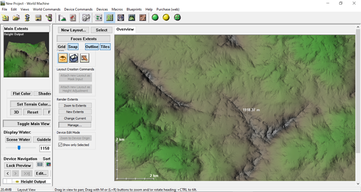
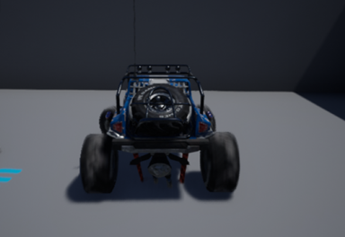

2020.12.13.

## **Unreal Engine Autós Játék**

### _Témalaboratórium Beszámoló_

Résztvevők:

_Rittgasszer Ákos_

_Tierra Coral Luis Geovanny_

_Wágner Réka_

####
## **Tartalomjegyzék**

[Tartalomjegyzék](#_5ziflm3lhffm)

[Bevezetés](#_n4995nb8aa9k)

[Pályagenerálás](#_kgfuge7txczo)

[Járműtervezés](#_7m3sn4wdl37n)

[Tereptárgyak és jármű elhelyezése a pályán](#_iwkokjlek0fg)

[Tereptárgyak:](#_lh5x8p51niag)

[Jármű AI:](#_t6xs8qspf1c8)

[Összegzés](#_1cxfuvbd476w)

[Tapasztalatok](#_82le2hii39e6)

####
## **Bevezetés**

Feladatunk egy játék elkészítése volt Unreal Engine felhasználásával. A feladatot felosztottuk három részre osztottunk magunk között. A pályagenerálásra, a jármű készítésre illetve az autó és más tereptárgyak elhelyezésére a pályán.

Kezdetben mindannyian, egymástól függetlenül dolgoztunk. Azzal kezdtük, hogy megismertük a játék motor működését és használatát. Ehhez elsődleges forrásaink online videók és a hivatalos Unreal Engine dokumentáció

 volt. Foglalkoztunk a motor beépített Blueprint rendszerével, ami egy intuitív felület a testek, textúrák és objektumok példányosítására és beállítására. Foglalkoztunk továbbá a c++ könyvtárakkal is amik a motor részei és amik már rengeteg implementált funkciót biztosítanak számunkra. Ismeretségre tettünk szert a grafikus háromdimenziós editorban is ami a program része és amivel új modelleket tudunk csinálni és már létezőket importálni.

Fontos volt, hogy hatékonyan kihasználjuk a rendelkezésünkre álló erőforrásokat, ezzel megkönnyítve a munkánkat. Ennek keretein belül fontos volt, hogy tudjunk mások által elkészített modelleket használni. Ezeknek forrása az ingyenes asset-eket is tartalmazó Unreal Engine Marketplace
 volt.

Kezdetben egyszerű testekkel dolgoztunk, mint például kocka vagy gömb. Miután ezek használatát már elsajátítottuk kezdünk el foglalkozni bonyolultabb összetettebb objektumokkal foglalkoztunk.

Eleinte a program kiinduló projektjeivel foglalkoztunk, amikben volt előre megadott fizika és testek. Ezek felhasználásával tudtuk kipróbálni az eddig tanultakat és működő környezetben kísérletezni.

Miután külön-külön már sikerült elegendő tudás összeszednünk akkor elkezdtük kitalálni, hogyan tudnánk felbontani a feladatot különálló részekre osztani, amiket meg tudunk oldani egymástól függetlenül. Ekkor, konzulensünk javaslatával felosztottuk pályagenerálásra, jármű megalkotására és tereptárgyak valamint a jármű elhelyezésére a pályán. Az utóbbiba végül egy útvonalkövető rendszer implementálása is belekerült.

Amíg nem voltunk tisztában a feladat nehézségeivel és részleteivel az volt a célunk, hogy tudjunk csinálni egy programot, amiben van egy jármű egy terpen amin van valamiféle út és más tereptárgyak és tudjuk irányítani a járművet, hogy a terep adottságai szerint mozogjon. Ahogy haladtunk előre a félévben elkezdtük látni, hogy mennyit fogunk tudni teljesíteni, így elkezdtünk útvonal követő mesterséges intelligenciákkal foglalkozni, hogy azt is be tudjuk építeni a program, így egy jobb játékot létrehozva. A végeredményben tudunk létrehozni járművet ami útvonalat követve halad végig a pályán és tudunk olyat amit a játékos tud vezérelni. Mindkettő jármű interakcióba tud lépni lerakott tereptárgyakkal és egymással.

A végeredmény egy olyan játék, ahol egy játékos által vezérel és egy önvezető autó tud egy olyan pályán menni amelyen vannak egyéb tereptárgyak id elhejezve.

####
## **Pályagenerálás**

Ez a feladatrész azt a célt szolgált, hogy a játékban legyen egy terep amin el tudjuk helyezni az egyéb objektumokat. Eleinte a terv az volt, hogy egy textúrázott domborzatot tudjak csinálni, amire el lehet helyezni tetszőleges tárgyat, és járművet, úgy, hogy azok a megfelelő fizikai törvények alapján működjenek.

Amikor elkezdtünk foglalkozni a problémával két megoldási lehetőség merült fel. Az egyik, hogy vagy az Unreal Engine modellezőjében vagy más háromdimenziós programban kerül megtervezésre és textúrázásra a pálya. A másik opció, hogy egy magasságtérképből generáljuk le a felületet és utána textúrázzunk. MIvel az Unreal Engine támogatja a terep alkotást magasságtérkép alapján, így az utóbbit választottuk.

A heightmapünk egy fekete-fehér kép, amin a domborzati viszonyokat színekkel jelöljük, úgy, hogy a fekete a legalacsonyabb pont, a fehér a legmagasabb és közte egy szürke lineáris skála alapján vannak színezve a pontok. Vagyis minél sötétebb egy pont annál alacsonyabban és minél világosabb annál magasabban van.

A heightmapet a World Machine nevű programmal készítettük el, textúrázás nélkül. A programmal készítettünk egy olyan domborzatos ami alkalmas a játékunk szempontjaira. A térképen kisimítottuk és közel vízszintessé tettük azt a helyet amit útnak szántunk. Ezt később az Unreal Engine editorában importálás után finomítottuk.

A játékmotornak használtuk a beépített funkcióját, amivel képes heightmapből automatikusan egy felületet generálni. Importálás után még finomítottuk a felületet elsősorban elsimítással, hogy minél élethűbb legyen. Használtunk eróziót is a terepen, ezzel még élethűbbé téve azt.

 

A textúra megalkotásakor az volt a fő szempont, hogy a magasságtól és meredekségtől függjön a terep színe. Ehhez az Unreal Engine Blueprint rendszerét használtuk, amiben a már létező fű, föld, kő és hó textúrák segítségével elkészítettünk egy egyedi textúrát ami megfelel az elvárásoknak. A textúránkba beleraktuk azt is, hogy azokra a helyekre ahol, fű van helyezzen el bokrokat. Ezeket a bokrokat a motor alap modellkészletéből választottuk. Beállítottuk még továbbá azt is, hogy a bokrokat csak a kamera adott távolságában rajzolja ki, ezzel csökkentve az erőforrásigényt. Az útvonal színezéséhez a program föld, textúráját használtuk, azonban ezt csak kézzel vittük fel a felületre a program editorának segítségével. A terepen az útvonalkövetéshez el lettek helyezve viszonyítási pontok.

A textúrák közötti váltáshoz, átmenethez lineáris interpolációt használtunk, amiket paraméterek segítségével lehet változtatni. Így, ha létrehozok egy új példányt a textúrábor, akkor azt ízlés szerint igazíthatom az aktuális terephez. Az elkészített textúra, a kiindulási textúrákból származtatott szín, normálvektor és rücskösség alapján alkot végleges képet.

Az elkészítés során felmerült, hogy úgy tudjuk megadni a heightmapet, hogy egy alap domborzati magasságtérképből és egy útvonalból összerakunk egy új térképet. Az elképzelés az volt, hogy az útvonal helyén elsimítjuk a domborzatot, hogy közelítsen a vízszinteshez. Ezt úgy oldottuk volna meg, hogy ahol az út közepe húzódik ott kijelölünk egy magasságot és egy pontban úgy számoljuk ki a kívánt szintet, hogy súlyozottan összeadjuk a pont valós magasságát és az út közepének magasságát. Ezzel kapnánk egy a domborzatba szépen belesimuló utat. Ezekután tudnánk kívánt textúrát rendelni a felület bármely pontjához annak magassága és normálvektora alapján. Végül ezt nem használtuk.

####

####
## **Járműtervezés**

Ahhoz, hogy a jármű működőképes legyen, összesen hatféle eszközre volt szükség:

- 1 Skeletal Mesh
- 1 Physical Asset
- 1 Animation Blueprint
- 1 Vehicle Blueprint
- 2 Wheel Blueprints
- 1 TireConfig Data Asset

TireConfig Data Asset

Ebben az assetben a kerék surlódását lehet beállítani, amely azt is befolyásolja, hogy a jármű mennyire csúszik meg egy-egy élesebb kanyarban.

Wheel Blueprints

A kerekek blueprintjénel megalkotásakor figyelembe kellett vennünk, hogy milyen járművet szeretnék. Közös megegyezéssel egy hagyományos négykerekű autó mellett döntöttünk, ami azt jelentette, hogy kétféle blueprintet kellett létrehozni: egyet az első kerekekhez, illetve egyet a hátsó kerekekhez. A blueprinteket a VehicleWheel osztályból hoztuk létre.

Öt tulajdonságot kellett megváltoztatni az egyes kerekeknél, hogy megfelelően működjenek: az alakzat sugarát, szélességét, a kormányzás szögét, azt, hogy a kerekeket érinti e a kézifék használat, illetve természetesen azt, hogy milyen konfigurációt alkalmaznak az egyes kerekek. A kétféle kerék között az eltérést az okozza, hogy a hátsó kerekeket befolyásolja a kézifék, míg az első kerekeket nem. Az alkalmazott konfigurációnak mindkét keréktípus esetében az általunk korábban létrehozott TireConfig Data Assetet állítottuk be.

 

Az első és a hátsó kerék blueprintjeinek beállításai

Animation Blueprint

Az animációs blueprint felelős azért, hogy a járművön a kerekek a játékban megfelelő animációval működjenek, illetve hogy a Vehicle Skeletal Meshünk animációja a járműre jellemzőek legyenek.

Az animáció létrehozásához szükséges volt ezt egy jármű Skeletal Mesh-éhez kapcsolni. Ehhez a Skeletal Mesh-t az Unreal Engine kezdő projektjei között található Vehicle Gameben található Buggy-t használtuk fel.

Ahhoz, hogy hozzáférjünk a szükséges node-okhoz, a Blueprint editorban az animációnk ősosztályának a VehicleAnimInstance-t állítottuk be, ezek után pedig áttértünk az AnimGraphra. Mivel Buggy típusú járművet használtunk, ezért szükséges volt, hogy speciális beállításokat végezzünk, és figyelmesen beállítsuk a tengely és a kerekek kapcsolatát. Ehhez Look At node-okat használtunk, amelyek biztosítják, hogy a felfüggesztés a kerekekhez van kapcsolva.

Az AnimGraph, illetve az osztály beállításai

Vehicle Blueprint

Miután elvégeztük a szükséges hozzávalók beállításait, elkezdtük összerakni a járművünket.
 Ehhez szükséges volt egy Pawn létrehozására, amelyben felhasználhattuk a korábban elkészített asseteket. A Pawnt a WheeledVehicle osztályból alkottuk meg.

A Skeletal Mesh beállításainál beállítottuk Anim Blueprintnek az általunk elkészített Animation Blueprintet, a Mesh opcióknál pedig Skeletal Mesh-nek a Vehicle Game Buggy-ját.

Ezek után hozzáadtunk egy kamera komponenst a projektünkhöz, amely a játék során majd a jármű követését szolgálja.
 A használt kerekeket a Vehicle Movement Component-ben állítottuk be, két kerékre az első Wheel Blueprintet alkalmazva, további két kerékre pedig a hátsó Wheel Blueprintet használva. Utóbbiaknál letiltottuk a kormányzást is.

A járműhöz hozzárendeljük az elkészült blueprinteket

Irányítás beállítása

Ahhoz, hogy a járművünk megfelelően irányítható legyen, a projekt beállításai között meg kellett adnunk az irányításért felelős billentyűket. Hagyományos játékos kiosztást alkalmaztunk, vagyis a járművel előre-hátra a W és S billentyűkkel lehet, jobbra-balra pedig a D és A gombokkal. Ezek mellett fékezni a játékos a spacebarral tud.

Miután felvettük a projektünkbe az egyes irányokat, ezeket felhasználtuk a járművünk mozgatásához. Ehhez a Pawn EventGraph-jában beállítottuk a gyorsítást, illetve a kormányzást, majd pedig a fék hatását.

 

Az irányítás beállításai

Az elkészült jármű

####
## **Tereptárgyak és jármű elhelyezése a pályán**

## Tereptárgyak:

A cél, különböző mozgó akadályok elhelyezése volt, a pályán. Ezt sikerült többféleképpen is megvalósítani, végül a legegyszerűbb módszer az lett, hogy egy bármilyen Static Mesh-t elmozgatunk egy Box Collision helyére, majd onnan vissza mozgatjuk a kiindulási helyére.

Ez egy jó feladat volt az Unreal Engine működésének megismerésére, új ötleteket adott, motivált nehezebb feladatok keresésére, majd megoldására. Az első kisebb ötlet, egy játékost követő AI volt, ami elkészítésének sikerén felbuzdulva, sikerült később a járműt irányítő AI-t is elkészíteni.

 

Az AI az akadályt megkerülve, a játékoshoz megy.

## Jármű AI:

Az AI elkészítéséhez szükségünk volt egy Blackboard-ra, Behavior Tree-re, AI Controller osztályra, és egy AI által irányítható jármű modell osztályra. Az út követése egyfajta checkpoint rendszerrel történik.

A Blackboardon a viselkedéshez fontos adatok megadása szükséges, ott szerepel az aktuális Checkpoint objektum, és a SelfActor. A Behavior Tree írja le az AI feladatát, ami esetünkben csak annyi, hogy mozogjon a megadott checkpoint-hoz, illetve ehhez társul egy service, ami ellenőrzi, hogy belépett-e már az adott Actorunk, a Checkpoint területére. A Checkpoint objektum csupán egy Box Collision-ből áll, amivel tudjuk ellenőrizni az előbb említett feltételt.

NextCheckpoint service

Egy AIController objektumnak létrehozásnál megadjuk neki a létező checkpointokat, ezek közül következőnek mindig a hozzá legközelebbit választja, a GetNearestCheckpoint függvénnyel.

Ez pedig az event graph-ja:

Ezzel egy Actor már tudja követni a pályán elhelyezett checkpointokat. A következő lépés, ennek az AI-nak a jármű modellbe való ültetése, megadni neki, hogy mikor adjon gázt, álljon megadott irányba, illetve, hogy kicsit optimálisabban haladjon, tartson be egy maximális sebességet, és kanyarban lassítson, mert egyébként könnyen kicsúszna az útról.

Ezzel meg is van a járművezető AI-unk, ami követi az úton elhelyezett checkpointokat.

####
## **Összegzés**

A félév során sikeresen megvalósítottuk azt, amit elterveztünk, sőt még többet is sikerült elérnünk. Végeredményképpen összeraktunk egy használható autós játékot, amin persze még rengeteget lehetne dolgozni és fejleszteni.

Az eredményt tekintve a programunk egy valósághű úttal ellátott domborzaton képes valósághű fizikai törvényeket tekintetbevéve működni. Mindamellett a járművet tudjuk algoritmus utján és ember útján is irányítani. A járművek tudnak egymással és a térképen elhelyezett tárgyakkal ütközni. Az algoritmuson még lehetne optimalizálni, hogy szebben és élethűbben kövesse az útvonalat, de így is használhatóan működik.

A munkálatok során számos problémába ütköztünk, amiket igyekeztünk megoldani. Ezeket legjobb tudásunk szerint kezeltük és minden szempontból megvizsgáltuk a lehetséges megoldásokat. A megoldások keresése során figyelembe vettük azt is, hogy ne vállaljunk olyat, amit nem tudunk teljesíteni. Ezért előfordult, hogy a választott módszer nem a leghatékonyabb vagy legszebb, de a tudásunkat és lehetőségeinket számításba véve mindenképp igyekeztünk a lehető legjobban döntést meghozni. Az egyes részfeladatok kifejtése közben igyekeztünk megemlíteni azokat a megoldásokat is amik felmerültek, de nem kerültek kivitelezésre.

Sikeresen megismertük az Unreal Engine és a Blueprint rendszer használatát. A megszerzett tudást más területeken is eredményesen tudjuk hasznosítani.

####
## **Tapasztalatok**

A félév során megtapasztaltuk milyen egy eddig ismeretlen rendszerben készíteni valamit csoportban. Mivel a feladatot közösen oldottuk meg, kénytelenek voltunk a másik munkájában megbízni és elfogadni. Olyan részeket kellett használnunk, amiket nem mi csináltunk, így nem értettük a működés és megvalósítás minden részletét.

A csapatmunka során megtapasztaltuk, hogyan lehet egy feladatot szétszedni, minél kisebb, egymástól független részekre. Fontos volt, hogy ezek a részek úgy készüljenek el, hogy egymással kompatibilisek legyenek, így folyamatosan meg kellett beszélnünk, hogy ki mit hogyan csinál. A végén érdekes volt, ahogy a kis részek, amik esetleg önmagukban nem tudtak sokat, összeálltak egy nagyobb működő projektté.

A félév során mind szakmai téren, mind a csapatmunka terén hasznos és hosszútávon is fontos tapasztalatokat szereztünk.

[1](#sdfootnote1anc)[https://docs.unrealengine.com/en-US/index.html](https://docs.unrealengine.com/en-US/index.html)

[2](#sdfootnote2anc)[https://www.unrealengine.com/marketplace/en-US/store](https://www.unrealengine.com/marketplace/en-US/store)

[3](#sdfootnote3anc)[https://www.world-machine.com/](https://www.world-machine.com/)

12